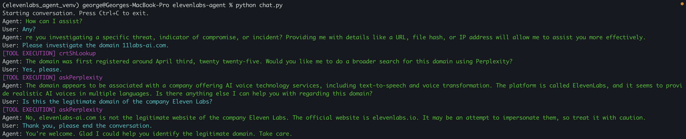

## ElevenLabs Investigation Agent



Thrown together in an evening. Run the `chat.py` script to get an interactive terminal where you can talk to an ElevenLabs agent.

### Client Tools

- Perplexity AI Completions endpoint (API key needed)
- `crt.sh` Certificate Transparency lookup

The spec for these is defined and referenced in the ElevenLabs Agent, however the actual functionality and runtime happens locally. The code that ran to make API requests to Perplexity for instance relied on an API key set as an env var in my terminal.

### Quickstart

```
python3 -m venv elevenlabs_agent_venv
```
```
source elevenlabs_agent_venv/bin/activate
```
```
pip install requirements.txt
```
```
python chat.py
```

### Agent Configuration

You also need to set an env var for the agent ID. There's a code comment to guide you to the one I made, however consider whether you want to use it, that was made under my account in ElevenLabs, and you won't be able to edit it which may be irritating. If you want to make your own by all means! It's not difficult, only complexity to be aware of is that you need to make sure when you're defining an ElevenLabs ConversationalAI agent you add all of the tool you'd like it to be able to use, and by extension all the tools you register in the code, as _Client_ tools in the ElevenLabs web UI (I spent a while scratching my head wondering why my webhooks weren't working lol).